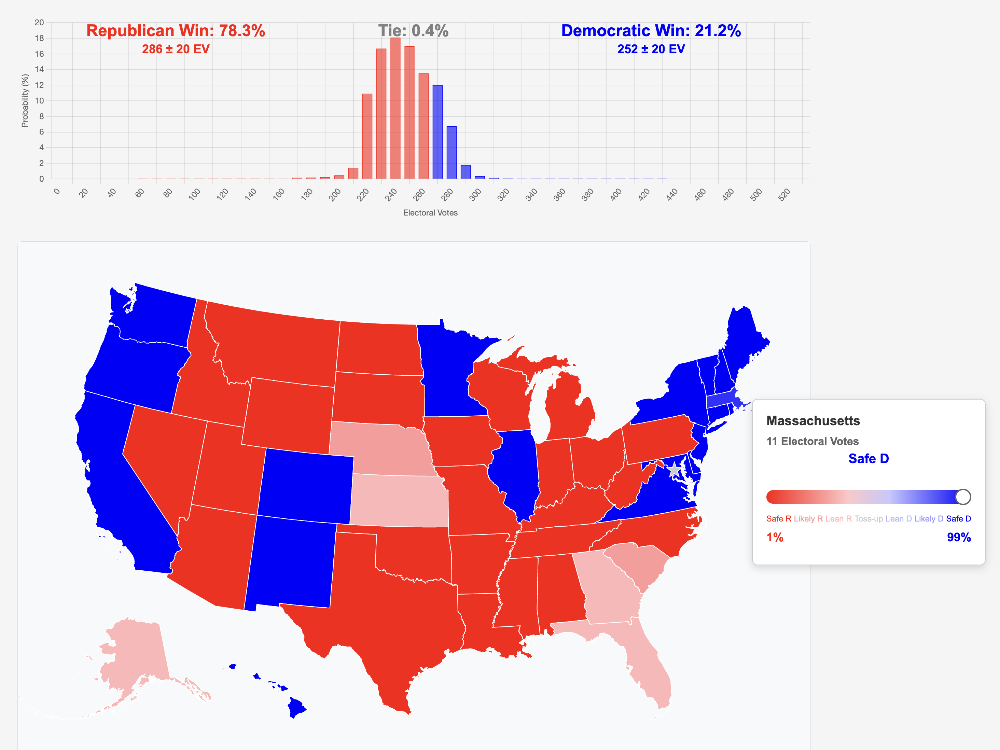

# Electoral College Probability Simulator

An interactive visualization tool for exploring electoral college scenarios based on state-by-state win probabilities. Users can adjust each party's win probabilities for each state and see how it affects the overall electoral vote distribution.



## Features

### Interactive Map
- Click any state to adjust win probabilities
- Color coding reflects probability levels:
  - Deep Red (Safe R): 1% Democratic win probability
  - Light Red (Likely R): 25% Democratic win probability
  - Pink (Lean R): 40% Democratic win probability
  - Gray (Toss-up): 50% Democratic win probability
  - Light Blue (Lean D): 60% Democratic win probability
  - Blue (Likely D): 75% Democratic win probability
  - Deep Blue (Safe D): 99% Democratic win probability
- Hover information shows state name, electoral votes, and current probabilities
- Special star marker for DC ensures easy access despite small geographic size

### Real-time Distribution Chart
- Bar chart updates automatically as you adjust state probabilities
- Shows probability distribution of total Democratic electoral votes
- X-axis shows possible electoral vote totals
- Y-axis shows probability of each outcome

## Technical Details

Built with:
- Python/Flask backend
- D3.js for map visualization
- Chart.js for probability distribution
- Topojson for map data

## Setup

1. Clone the repository:
```bash
git clone https://github.com/yourusername/electoral-college-simulator.git
cd electoral-college-simulator
```

2. Install requirements:
```bash
pip install -r requirements.txt
```

3. Run the application:
```bash
python app.py
```

4. Open your browser and navigate to:
```
http://localhost:5000
```

## Usage

1. Hover over on any state to bring up the probability adjuster
2. Use the slider to set win probability for that state
3. Watch the distribution chart update in real-time

## Future Enhancements

- Save and share functionality
- Historical data integration
- Correlation between state probabilities
- Tipping point state analysis
- Mobile-friendly responsive design
- Add third parties

## Contributing

Contributions are welcome! Please feel free to submit a Pull Request.

## License

This project is licensed under the MIT License - see the LICENSE file for details.

## Acknowledgments

- Electoral vote data from the 2024 presidential election
- US state boundary data from US Census Bureau

## Author

Adam Holmes

## Contact

- GitHub: [@aaholmes](https://github.com/aaholmes)
- Email: adamaholmes@gmail.com
